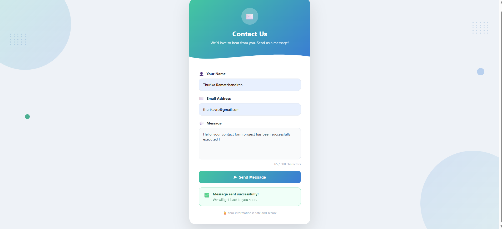
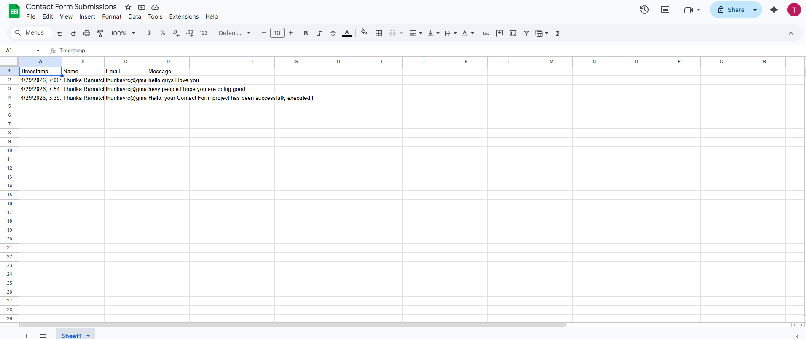
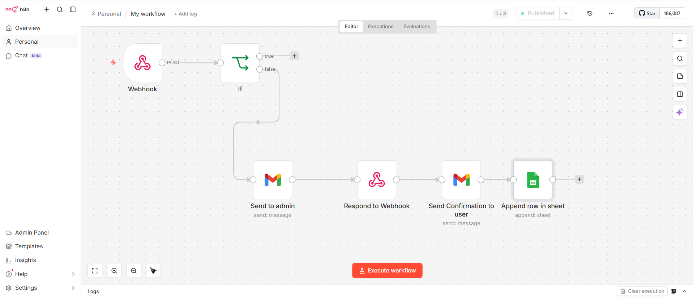

# 📬 Smart Contact Form with Email Automation

A full-stack contact form built with **React** and **n8n** that handles form submissions, sends email notifications, and logs data to Google Sheets — all automatically.

---

## 🚀 Features

- **Form Validation** — Real-time input validation to ensure clean data submission
- **Loading Spinner** — Visual feedback while the form is being submitted
- **Character Counter** — Live character count for the message field (max 500)
- **Confirmation Email** — Automated email sent to the user upon successful submission
- **Admin Notification** — Instant email alert sent to the admin for every new submission
- **Google Sheets Logging** — Every submission is automatically saved to a Google Sheet with a timestamp
- **Spam Protection** — n8n workflow filters and validates incoming data before processing

---

## 🛠️ Tech Stack

| Layer | Technology |
|-------|-----------|
| Frontend | React.js |
| Automation | n8n (self-hosted) |
| Email | Gmail (via n8n) |
| Database | Google Sheets (via n8n) |

---

## ⚙️ How It Works

1. User fills out the contact form (Name, Email, Message) in the React app
2. On submit, the form sends a **POST request** to an n8n Webhook
3. n8n checks for spam using an **If condition**
4. If valid:
   - Sends a **notification email to the admin**
   - Sends a **confirmation email to the user**
   - **Appends a new row** to Google Sheets with timestamp, name, email, and message
5. The React app displays a **"Message sent successfully!"** confirmation

---

## 📸 Screenshots

### Contact Form


### Google Sheets Log


### n8n Workflow


---

## 🧩 n8n Workflow Structure

```
Webhook (POST)
    └── If (Spam check)
            └── [true] Send to Admin (Gmail)
                    └── Respond to Webhook
                            └── Send Confirmation to User (Gmail)
                                    └── Append Row in Google Sheet
```

---

## 📂 Project Structure

```
smart-contact-form/
├── public/
│   └── index.html
├── src/
│   ├── App.js
│   ├── App.css
│   └── index.js
├── n8n-workflow.json      ← Import this into n8n
├── package.json
└── README.md
```

---

## 🖥️ Running Locally

1. **Clone the repository**
   ```bash
   git clone https://github.com/thurikavrc/smart-contact-form.git
   cd smart-contact-form
   ```

2. **Install dependencies**
   ```bash
   npm install
   ```

3. **Start the React app**
   ```bash
   npm start
   ```
   Open [http://localhost:3000](http://localhost:3000) in your browser.

4. **Import the n8n workflow**
   - Open your n8n instance
   - Click **"Import from file"**
   - Select `n8n-workflow.json`
   - Update your Gmail and Google Sheets credentials
   - Activate the workflow

---

## 👩‍💻 Author

**Thurika Ramatchandiran**  
[GitHub](https://github.com/thurikavrc)
